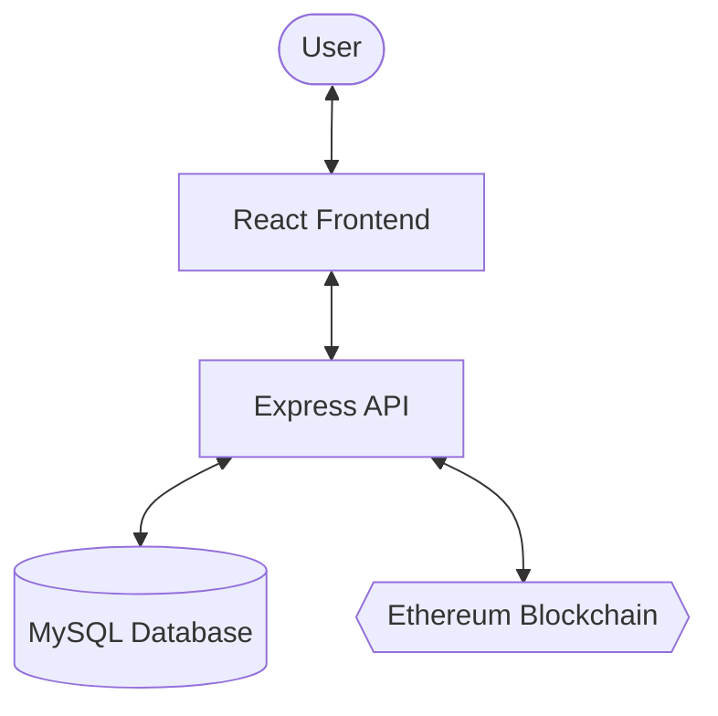

# Project Report: Blockchain-Enabled Secure Document Management and Verification System

## 1. Introduction
The Blockchain-Enabled Secure Document Management and Verification System is a decentralized platform designed to ensure the integrity, authenticity, and transparency of digital documents. By leveraging blockchain technology, the system provides an immutable audit trail for documents, preventing tempering and unauthorized modifications.

## 2. Technology Stack
The system is built using a modern, scalable technology stack:

| Component | Technology |
| :--- | :--- |
| **Frontend** | React.js, Tailwind CSS, Framer Motion, Lucide React |
| **Backend** | Node.js, Express.js |
| **Database** | MySQL (Relational data storage) |
| **Blockchain** | Ethereum (via Hardhat/Solidity), Web3.js |
| **Authentication** | JSON Web Tokens (JWT), Bcrypt |
| **File Handling** | Multer (for uploads), Node.js `fs` module |
| **Containerization**| Docker, Docker Compose |

## 3. System Architecture and Data Flow

### 3.1. High-Level Architecture
The application follows a client-server architecture with a integration layer for blockchain interactions.

### 3.2. Detailed Data Flow
1.  **Document Upload**: An authorized Uploader selects a file and enters metadata (e.g., expiry date).
2.  **Hashing**: The server generates a unique SHA-256 digital fingerprint (hash) of the file.
3.  **Blockchain Anchoring**: The document hash is stored on the Ethereum blockchain via a smart contract. This provides an immutable timestamp and proof-of-existence.
4.  **Database Storage**: Document metadata, the file path, and the blockchain transaction hash are stored in the MySQL database.
5.  **Proof Generation**: A "Verification Certificate" (Proof Object) is generated, containing the document hash, transaction details, and institution information.
6.  **Verification (Instant)**: A user uploads a file to the "Instant Verification" page. The system re-computes the hash and compares it with the one anchored on the blockchain/database.
7.  **Verification (Online)**: A user visits a unique URL containing a proof hash. The system retrieves the proof object, re-verifies its cryptographic integrity, and displays the status (Valid/Tampered/Expired).

## 4. Key Features
- **Role-Based Access Control (RBAC)**: Distinct permissions for Admins, Uploaders, and Verifiers.
- **Institution Management**: Admins approve or reject institution registration requests from uploaders.
- **Immutable Verification**: Uses blockchain to guarantee document authenticity.
- **Expiry Logic**: Automatic invalidation of documents past their expiry date, with clear visual indicators.
- **Tamper Detection**: Cryptographic integrity checks on every verification request.
- **Responsive Dashboards**: Real-time analytics and document management for all roles.

## 5. Implementation Details

### 5.1. Cryptographic Integrity (The Hashing Solution)
To solve discrepancies between in-memory data and database storage, the system implements a "JSON Roundtrip" hashing strategy. This ensures that dates and complex objects are always normalized to their stored string format before a hash is computed, preventing false "Tampered" flags.

### 5.2. Blockchain Integration
The system uses a custom Smart Contract deployed on an Ethereum-compatible network. 
- **`recordDocument(bytes32 docHash)`**: Function to anchor a document.
- **`verifyDocument(bytes32 docHash)`**: Function to retrieve anchoring status and block numbers.

### 5.3. Security Measures
- **Password Hashing**: Bcrypt is used for secure user credential storage.
- **JWT Security**: Tokens are used for session management with middleware that fetches fresh user state from the database on every request.
- **Rate Limiting**: Protection against brute-force verification attempts.

---
*Report Generated: January 2026*
